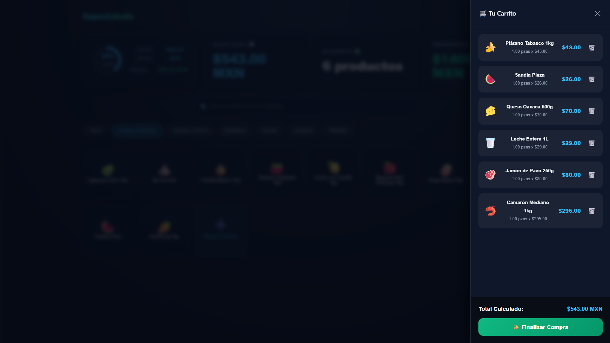
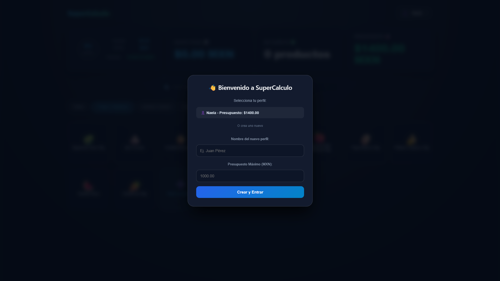
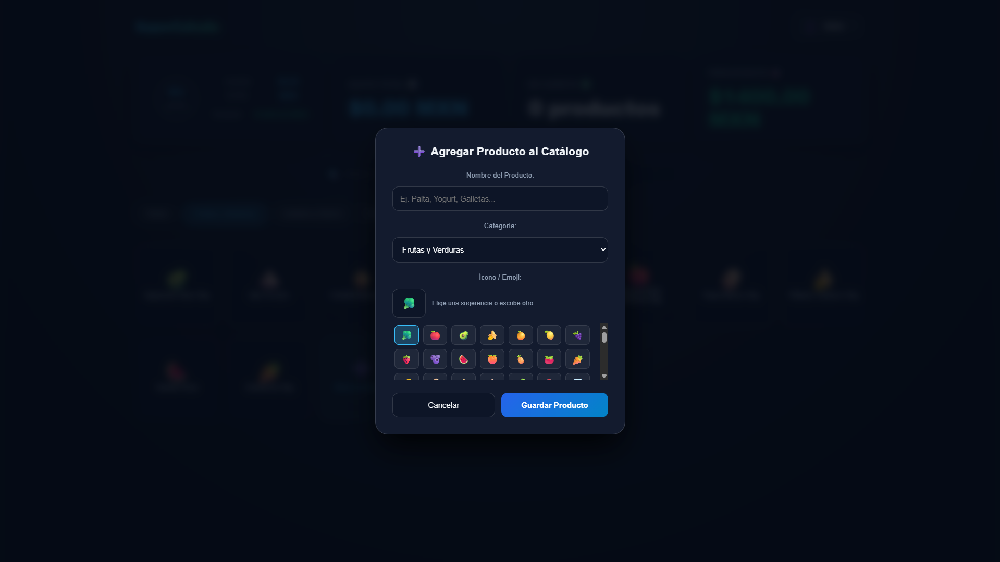
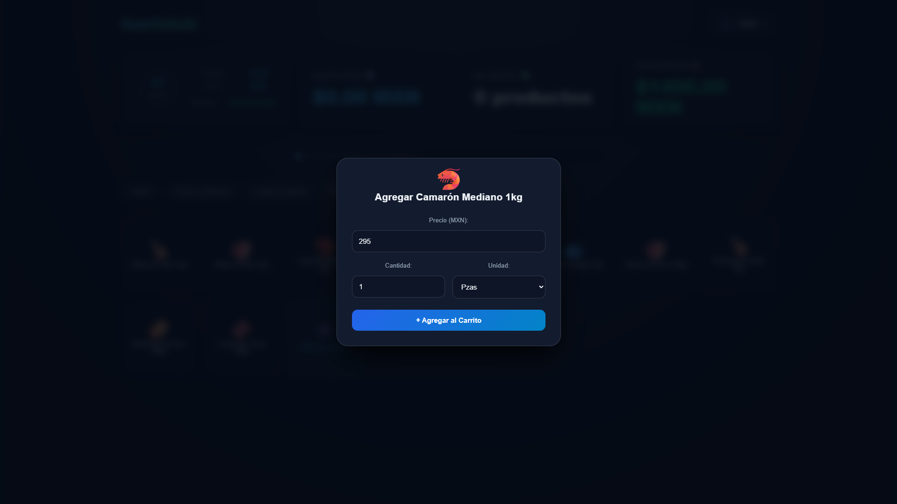
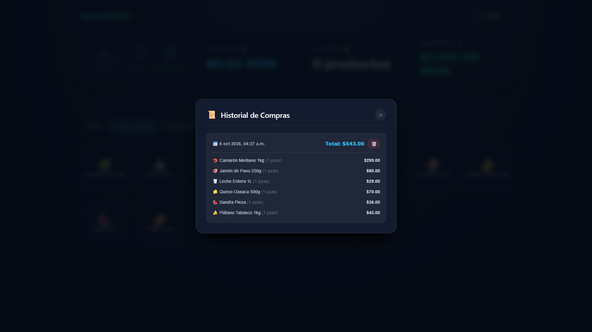

  

<h1 align="center">🛒 SuperCalculo</h1>

  <b>Una aplicación web interactiva para gestionar tu presupuesto y optimizar tus compras del supermercado en tiempo real.</b>

---

## 📌 Descripción General

**SuperCalculo** permite llevar un control preciso del presupuesto en tiempo real, administrar perfiles de usuario, organizar productos por categorías y mantener un historial detallado de compras.

---

## 📸 Vista Previa

| Inicio / Catálogo General | Filtrado por Categoría |
| :---: | :---: |
|  |  |

| Proceso de Compra Activa | Carrito Lateral |
| :---: | :---: |
|  |  |

---

## ✨ Características Principales

- **👤 Gestión de Perfiles y Presupuesto:** Configura diferentes perfiles de usuario estableciendo un presupuesto máximo en moneda local ($ MXN).
- **📊 Indicador Financiero en Tiempo Real:** Visualiza mediante gráficos dinámicos el porcentaje del presupuesto utilizado, el monto total gastado y el saldo restante.
- **🏷️ Catálogo Organizado por Categorías:** Explora artículos clasificados en Frutas y Verduras, Lácteos y Huevo, Despensa, Carnes, Limpieza, Bebidas y más.
- **🔍 Búsqueda Rápida:** Encuentra productos al instante con la barra de búsqueda integrada.
- **➕ Creación de Productos Personalizados:** Añade nuevos artículos al catálogo eligiendo nombre, categoría y asignando íconos/emojis interactivos.
- **🛒 Control del Carrito:** Selecciona cantidades, unidades (piezas, kg, etc.) y ajusta precios individualmente antes de confirmar tu compra.
- **📜 Historial de Compras:** Consulta registros anteriores con fechas, horas, desglose completo de productos y montos totales.

---

## 🖼️ Capturas de Pantalla y Flujo de Trabajo

### 1. Gestión de Perfiles
Crea o selecciona un perfil asignado con un límite de presupuesto.

### 2. Personalización e Inventario
Añade nuevos productos al catálogo con íconos representativos de manera intuitiva.

### 3. Selección y Modificación de Productos
Define el precio actual, la cantidad exacta y el tipo de unidad antes de agregar al carrito.

### 4. Historial de Transacciones
Revisa las compras finalizadas para llevar un seguimiento histórico de tus gastos.

---

## 🛠️ Tecnologías Utilizadas

- **Frontend:** HTML5, CSS3 / Tailwind CSS, JavaScript (ES6+) / React
- **Estilos:** Interfaz oscura (Dark Mode), diseño responsivo y moderno
- **Almacenamiento:** Persistence vía LocalStorage / Base de Datos

---